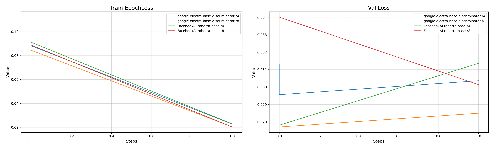
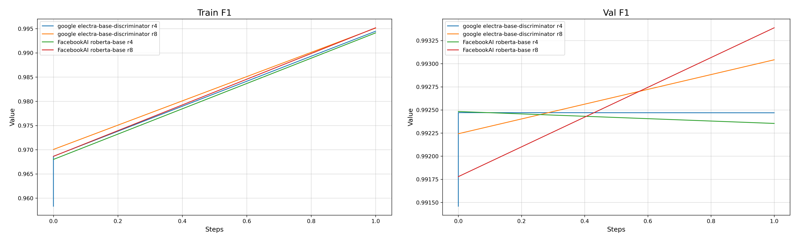
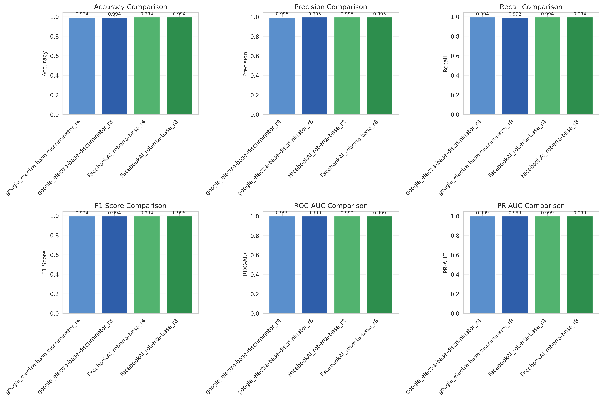
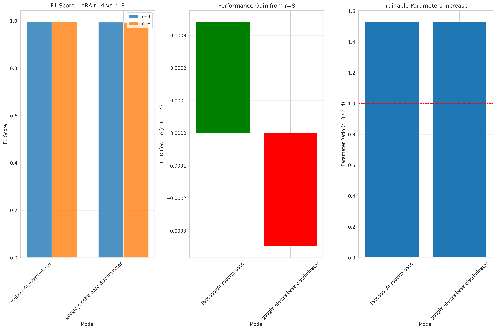
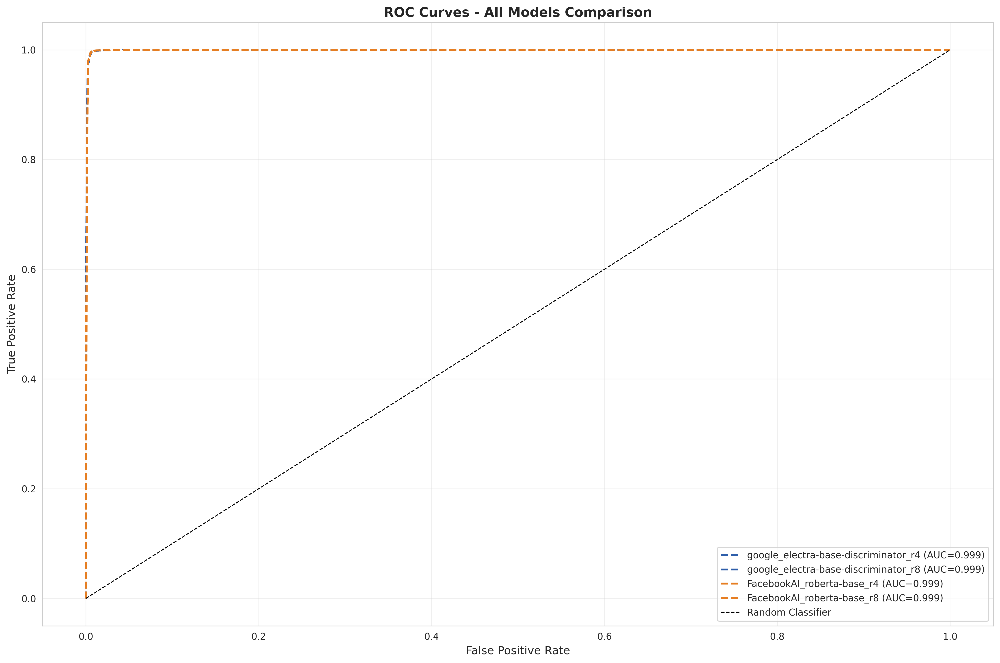
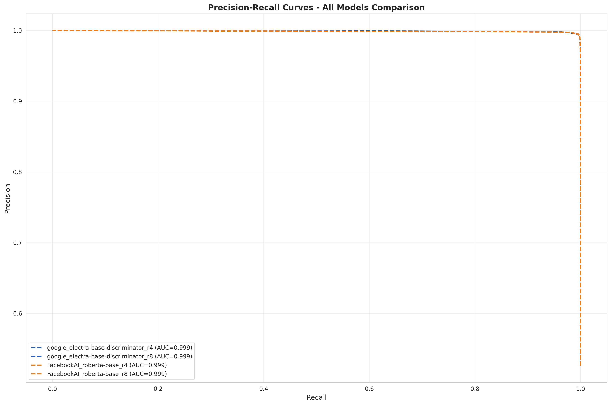
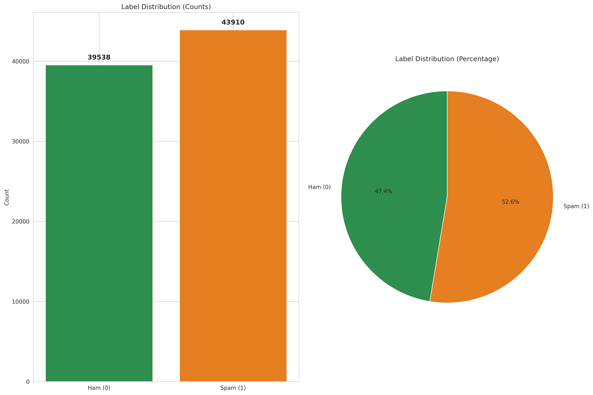
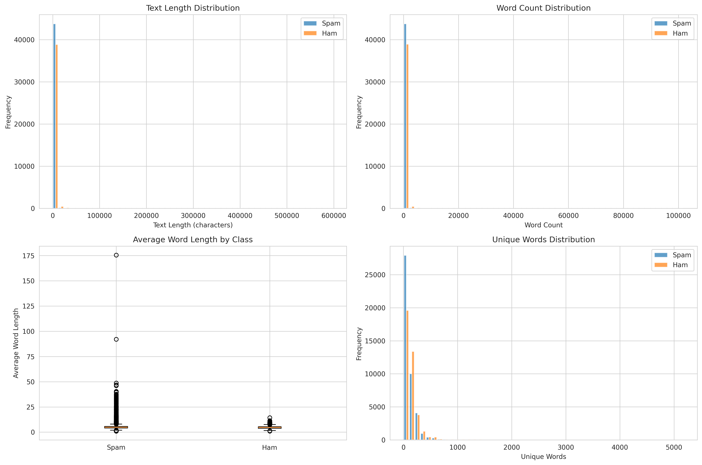
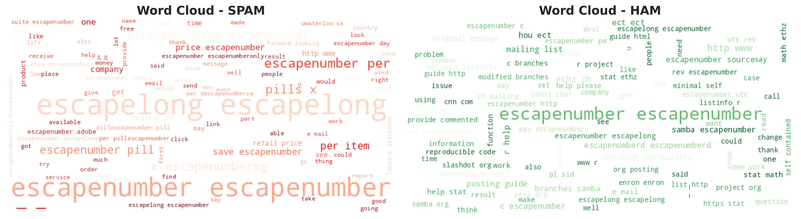

# Spam Email Classification using LoRA Fine-tuned Transformers

[](https://opensource.org/licenses/MIT)
[](https://www.python.org/downloads/)
[](https://pytorch.org/)
[](https://huggingface.co/transformers/)

High-performance spam email classification using LoRA-adapted transformer models (ELECTRA, RoBERTa). Achieves **99.4%+ accuracy** with parameter-efficient fine-tuning on 83K+ emails.

## 📊 Performance Highlights

| Model | LoRA Rank | Accuracy | Precision | Recall | F1 Score | ROC-AUC |
|-------|-----------|----------|-----------|--------|----------|---------|
| RoBERTa-base | r=8 | 99.45% | 99.52% | 99.43% | 99.48% | 0.9989 |
| RoBERTa-base | r=4 | 99.41% | 99.50% | 99.39% | 99.44% | 0.9990 |
| ELECTRA-base | r=4 | 99.39% | 99.45% | 99.39% | 99.42% | 0.9993 |
| ELECTRA-base | r=8 | 99.35% | 99.52% | 99.25% | 99.38% | 0.9993 |

**Key Insights:**
- All models achieve 99%+ accuracy with minimal performance variance
- LoRA rank (r=4 vs r=8) has marginal impact on performance
- Parameter-efficient fine-tuning uses only **0.1-1%** of total model parameters

---

## 🚀 Quick Start

### Environment Setup

```bash
# Install uv package manager
pip install uv

# Initialize project
uv init

# Create virtual environment with Python 3.10
uv venv --python=python3.10.18 venv_spam_classifier

# Activate environment
source venv_spam_classifier/bin/activate

# Install core dependencies
uv pip install pip
uv pip install numpy pandas matplotlib seaborn scikit-learn pyyaml wordcloud torch tqdm loguru peft datasets nltk spacy tensorboard

# Download spaCy language model
python -m spacy download en_core_web_sm

# Install PyTorch with CUDA support (adjust based on your CUDA version)
uv pip install torch --index-url https://download.pytorch.org/whl/cu118

# Install Transformers
uv pip install transformers
```

### Running Inference

#### Option 1: Using Pre-trained Models from HuggingFace

```python
from inference import SpamClassifier

# Initialize classifier with HuggingFace model
classifier = SpamClassifier(config_path="inference_config.yaml")

# Classify single email
email = "Subject: URGENT! You've won $1,000,000! Click here to claim now!"
result = classifier.predict_single(email)

print(f"Prediction: {result['label']}")
print(f"Confidence: {result['confidence']:.2%}")
print(f"Probabilities: {result['probabilities']}")
```

**Output:**
```
Prediction: SPAM
Confidence: 99.87%
Probabilities: {'HAM': 0.13%, 'SPAM': 99.87%}
```

#### Option 2: Command Line Interface

```bash
# Single email prediction
python inference.py --text "Subject: Meeting tomorrow at 2pm. See you there!"

# Batch prediction from CSV file
python inference.py --input_file emails.csv --output_file predictions.csv

# Using custom configuration
python inference.py --config custom_config.yaml --text "Your email here"
```

#### Input Format Requirements

The inference script accepts emails in the following formats:

1. **Plain text string:**
   ```python
   "Subject: Great Deal! Get 50% off now!"
   ```

2. **CSV file** with required column:
   ```csv
   text
   "Subject: Meeting tomorrow at 2pm"
   "Subject: You won $1000000!"
   ```

3. **Expected text preprocessing:**
   - Raw email text (no special preprocessing required)
   - Model handles tokenization automatically
   - Maximum sequence length: 512 tokens

---

## 🏗️ Project Structure

```
spam-email-classification-lora/
├── README.md                          # Project documentation
├── spam_classification.ipynb          # End-to-end training notebook
├── config.yaml                        # Training configuration
├── log/                               # Complete training logs
│   └── training.log
│
├── data/
│   └── emails.zip                     # Dataset (83K+ emails, 139MB)
│
├── inference/
│   ├── inference.py                   # Inference script
│   └── inference_config.yaml          # Inference configuration
│
├── tensorboard_plots/                 # Training metrics visualizations
│   ├── Loss_Metrics.png
│   ├── Accuracy_Scores.png
│   ├── Precision_Scores.png
│   ├── Recall_Scores.png
│   ├── F1_Scores.png
│   └── Train_LearningRate.png
│
└── visualizations/
    ├── eda/                           # Exploratory Data Analysis
    │   ├── class_distribution.png
    │   ├── text_statistics.png
    │   ├── token_length_analysis.png
    │   ├── ngram_analysis.png
    │   ├── wordclouds.png
    │   ├── special_character_analysis.png
    │   └── linguistic_analysis.png
    │
    └── results/                       # Model evaluation results
        ├── google_electra-base-discriminator_r4_evaluation.png
        ├── google_electra-base-discriminator_r8_evaluation.png
        ├── FacebookAI_roberta-base_r4_evaluation.png
        ├── FacebookAI_roberta-base_r8_evaluation.png
        ├── metrics_comparison.png
        ├── roc_curves_comparison.png
        ├── pr_curves_comparison.png
        └── lora_ablation_analysis.png
```

---

## 📖 Methodology

### Why LoRA Fine-tuning?

Instead of training a sequential neural network from scratch, this project uses **LoRA (Low-Rank Adaptation)** fine-tuning on pre-trained transformer models.

**Key Benefits:**
- ⚡ **Faster Development**: Hours instead of days for training
- 🎯 **Superior Performance**: Leverages pre-trained language understanding
- 💰 **Cost-Effective**: Significantly lower computational requirements
- 🔄 **Production-Ready**: Industry-standard approach used by OpenAI, Google, Meta
- 📦 **Memory Efficient**: Only 0.1-1% of parameters are trainable

### Model Architecture

**Base Models:**
- **ELECTRA-base-discriminator**: Efficient pre-training optimized for classification
- **RoBERTa-base**: Robust BERT optimization with proven text classification performance

**LoRA Configuration:**
- **Ranks tested**: r=4, r=8 (ablation study)
- **Target modules**: Query, Key, Value, and Output projection layers
- **Alpha**: 2 × rank (standard scaling)
- **Dropout**: 0.1

### Training Strategy

| Hyperparameter | Value | Rationale |
|----------------|-------|-----------|
| **Epochs** | 2 | Sufficient for fine-tuning; prevents overfitting |
| **Learning Rate** | 2e-4 | Standard for LoRA fine-tuning |
| **Batch Size** | 16 | Optimized for GPU memory efficiency |
| **Optimizer** | AdamW | Weight decay for regularization |
| **Scheduler** | Cosine with Warmup | Smooth learning rate decay |
| **Gradient Clipping** | 1.0 | Training stability |
| **Early Stopping** | Patience=2 | Prevents overfitting |

**Advanced Training Features:**
- Mixed precision (FP16) for faster training
- Automatic batch size reduction on OOM errors
- TensorBoard logging for real-time monitoring
- Gradient accumulation for effective larger batches
- Automatic checkpoint saving for best models

---

## 📊 Dataset Information

**Source:** [Email Spam Classification Dataset (Kaggle)](https://www.kaggle.com/datasets/purusinghvi/email-spam-classification-dataset)

**Statistics:**
- **Total Emails**: 83,448
- **Train Set**: 66,758 (80%)
- **Validation Set**: 8,345 (10%)
- **Test Set**: 8,345 (10%)
- **Class Distribution**: 47.4% HAM, 52.6% SPAM
- **File Size**: 139 MB (compressed)

**Data Characteristics:**
- Real-world email corpus with diverse spam patterns
- Includes subject lines and email body text
- Minimal preprocessing required (dataset is clean)
- Balanced classes for unbiased evaluation

---

## 🔬 Experimental Results

### Training Performance

<p align="center">
  
  
</p>

**Training Observations:**
- Rapid convergence within 2 epochs
- Minimal overfitting across all configurations
- Validation loss stabilizes early, indicating good generalization
- F1 scores consistently exceed 99% on validation set

### Model Comparison

<p align="center">
  
</p>

**Key Findings:**
1. All models achieve comparable performance (99%+ accuracy)
2. Marginal differences between LoRA ranks (r=4 vs r=8)
3. RoBERTa shows slight edge in F1 score
4. ELECTRA achieves highest ROC-AUC scores

### LoRA Ablation Study

<p align="center">
  
</p>

**Insights:**
- Higher rank (r=8) doesn't guarantee better performance
- r=4 provides excellent parameter efficiency
- Model architecture choice impacts performance more than rank
- Optimal rank depends on task complexity and dataset size

### ROC & Precision-Recall Curves

<p align="center">
  
  
</p>

**Analysis:**
- ROC-AUC scores of 0.998-0.999 indicate excellent discrimination
- High precision maintained across all recall levels
- Models perform consistently well on imbalanced thresholds
- Suitable for production deployment with minimal false positives

---

## 🎨 Exploratory Data Analysis

### Class Distribution & Statistics

<p align="center">
  
  
</p>

### Text Patterns Analysis

<p align="center">
  
</p>

**Distinctive Spam Patterns:**
- Promotional keywords: "free", "win", "offer", "discount"
- Urgency triggers: "now", "today", "limited", "urgent"
- Financial terms: "money", "cash", "prize", "claim"
- Call-to-action: "click", "visit", "order", "subscribe"

**HAM Email Characteristics:**
- Business communication: "meeting", "project", "attached", "regards"
- Technical terms: "code", "system", "server", "database"
- Conversational tone: personal pronouns and natural language

---

## 🤗 HuggingFace Model Hub

Pre-trained LoRA adapters are available on HuggingFace:

| Model | LoRA Rank | HuggingFace Link | Size |
|-------|-----------|------------------|------|
| ELECTRA-base | r=4 | [ssheroz/spam-email-classifier-electra-r4](https://huggingface.co/ssheroz/spam-email-classifier-electra-r4) | ~2MB |
| ELECTRA-base | r=8 | [ssheroz/spam-email-classifier-electra-r8](https://huggingface.co/ssheroz/spam-email-classifier-electra-r8) | ~4MB |
| RoBERTa-base | r=4 | [ssheroz/spam-email-classifier-roberta-r4](https://huggingface.co/ssheroz/spam-email-classifier-roberta-r4) | ~2MB |
| RoBERTa-base | r=8 | [ssheroz/spam-email-classifier-roberta-r8](https://huggingface.co/ssheroz/spam-email-classifier-roberta-r8) | ~4MB |

**Usage:**
```python
from transformers import AutoTokenizer, AutoModelForSequenceClassification
from peft import PeftModel

# Load base model and tokenizer
base_model = AutoModelForSequenceClassification.from_pretrained("google/electra-base-discriminator")
tokenizer = AutoTokenizer.from_pretrained("google/electra-base-discriminator")

# Load LoRA adapter
model = PeftModel.from_pretrained(base_model, "ssheroz/spam-email-classifier-electra-r4")
```

---

## 🛠️ Configuration

### Training Configuration (`config.yaml`)

Key parameters for reproducing the training:

```yaml
data:
  path: './data/emails.csv'
  text_column: 'text'
  label_column: 'label'
  train_split: 0.8
  val_split: 0.1
  test_split: 0.1

models:
  names:
    - './local_models/google_electra-base-discriminator'
    - './local_models/FacebookAI_roberta-base'
  max_length: 512

training:
  epochs: 2
  batch_size: 16
  learning_rate: 2e-4
  weight_decay: 0.01
  warmup_ratio: 0.1
  gradient_clipping: 1.0

lora:
  ranks: [4, 8]
  alpha: 'auto'
  dropout: 0.1
  target_modules: ['query', 'key', 'value', 'dense', 'q_proj', 'k_proj', 'v_proj', 'out_proj', 'lin1', 'lin2']
```

### Inference Configuration (`inference/inference_config.yaml`)

```yaml
model:
  base_model_name: "google/electra-base-discriminator"
  adapter_path: "ssheroz/spam-email-classifier-electra-r4"
  max_length: 512
  device: "cuda"

inference:
  batch_size: 8
  return_probabilities: true
  confidence_threshold: 0.5

output:
  labels:
    0: "HAM"
    1: "SPAM"
  verbose: true
```

---

## 📈 Training Logs

Complete training logs are available in `training.log`. Key milestones:

```
2025-11-22 00:41:05 | INFO | ELECTRA r=4 - Epoch 1/2
2025-11-22 00:41:05 | INFO | Train Loss: 0.0882 | Val Loss: 0.0296 | Val Acc: 0.9921

2025-11-22 03:01:30 | INFO | ELECTRA r=8 - Epoch 1/2
2025-11-22 03:01:30 | INFO | Train Loss: 0.0845 | Val Loss: 0.0277 | Val Acc: 0.9919

2025-11-22 08:43:55 | INFO | RoBERTa r=4 - Epoch 1/2
2025-11-22 08:43:55 | INFO | Train Loss: 0.0912 | Val Loss: 0.0278 | Val Acc: 0.9921

2025-11-22 17:48:41 | INFO | RoBERTa r=8 - Epoch 1/2
2025-11-22 17:48:41 | INFO | Train Loss: 0.0888 | Val Loss: 0.0340 | Val Acc: 0.9914

2025-11-22 22:48:00 | INFO | Evaluation complete - Best F1: 99.48% (RoBERTa-r8)
```

**Training Duration:**
- ELECTRA-base: ~2.3 hours per rank
- RoBERTa-base: ~9 hours per rank
- Total training time: ~23 hours (4 models)

---

## 🎯 Use Cases

This spam classifier is suitable for:

1. **Email Service Providers**
   - Automated spam filtering
   - User inbox protection
   - Phishing detection

2. **Enterprise Applications**
   - Corporate email security
   - Internal communication filtering
   - Compliance monitoring

3. **Research & Development**
   - Baseline for spam detection research
   - LoRA fine-tuning demonstrations
   - Transfer learning experiments

4. **Educational Purposes**
   - ML/NLP course projects
   - Transformer model tutorials
   - Production ML workflow examples

---

## 🔒 Limitations & Considerations

**Model Limitations:**
- Trained primarily on English emails
- Performance may degrade on newer spam patterns not in training data
- Requires retraining for domain-specific spam (e.g., social media, SMS)

**Ethical Considerations:**
- False positives can lead to missed important emails
- Adversarial spam may evade detection
- Regular model updates recommended to combat evolving spam tactics

**Production Recommendations:**
- Implement human-in-the-loop for high-stakes decisions
- Monitor model performance continuously
- Set appropriate confidence thresholds based on use case
- Consider ensemble methods for critical applications

---

## 📚 References

**Papers:**
- [LoRA: Low-Rank Adaptation of Large Language Models](https://arxiv.org/abs/2106.09685)
- [ELECTRA: Pre-training Text Encoders as Discriminators](https://arxiv.org/abs/2003.10555)
- [RoBERTa: A Robustly Optimized BERT Pretraining Approach](https://arxiv.org/abs/1907.11692)

**Libraries:**
- [Hugging Face Transformers](https://huggingface.co/docs/transformers)
- [PEFT: Parameter-Efficient Fine-Tuning](https://github.com/huggingface/peft)
- [PyTorch](https://pytorch.org/)

**Dataset:**
- [Email Spam Classification Dataset (Kaggle)](https://www.kaggle.com/datasets/purusinghvi/email-spam-classification-dataset)

---

## 📄 License

This project is licensed under the MIT License - see the [LICENSE](LICENSE) file for details.

---

## 🌟 Acknowledgments

- Kaggle for providing the email spam dataset
- Hugging Face for transformer models and PEFT library
- PyTorch team for the deep learning framework
- Open-source community for invaluable tools and resources

**If you find this project helpful, please consider giving it a ⭐ on GitHub!**